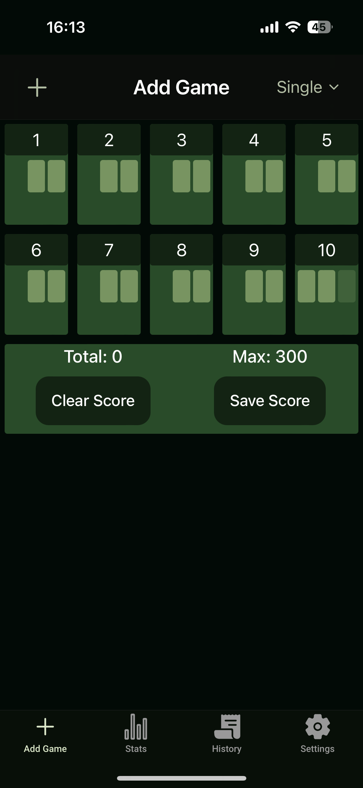
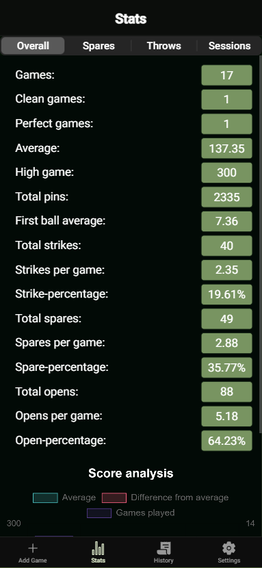
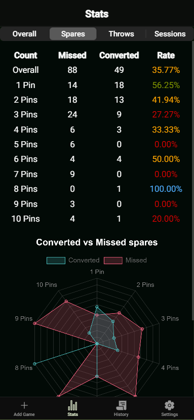
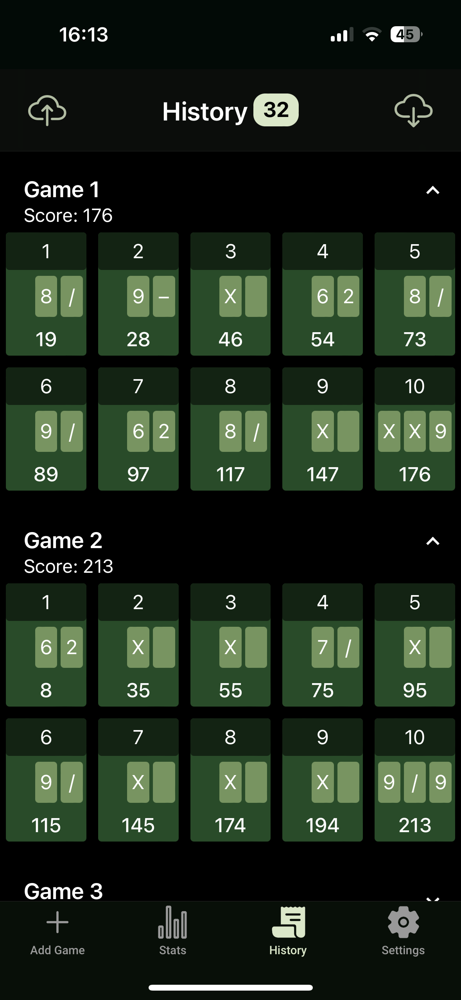

# Bowling Stats Tracker

Bowling Stats Tracker is a free app designed for bowlers of all skill levels, from beginners to pros. It helps track your games and statistics with ease, offering a clean and intuitive interface across four main tabs.

## Features

### Add Games

On the "Add" page, you can effortlessly log your games. There’s even an option to upload images of your scoresheet, allowing automatic entry of your scores (currently compatible with West-Bowl’s scoring system).



### View Statistics

The "Stats" page provides a comprehensive overview of your performance. Track key metrics like your average score, total strikes, spares, clean games, and more. You can also see which pin counts you miss most often. Additionally, a special section shows stats for the currently selected session.

 

### Game History

In the "History" section, you’ll find a detailed log of all your past games. Swipe right to share, swipe even further to edit, or swipe left to delete, . You can also export your game history to a readable Excel file or import games using the same format.



### Settings

The "Settings" page allows you to personalize your experience. Customize your username and choose from a range of color themes to suit your style.

## Contributing

Currently i don't want anybody to contribute yet. But i am free for suggestions and feature request.

## Feedback

If you have any feedback, please reach out to us at lightningbowlapp@gmail.com

## Run Locally

Clone the project

```bash
  git clone https://github.com/HappyKnuckles/bowling-stats.git
```

Go to the project directory

```bash
  cd bowling-stats
```

Install dependencies

```bash
  npm install
```

Start the server

```bash
  ionic serve
```
